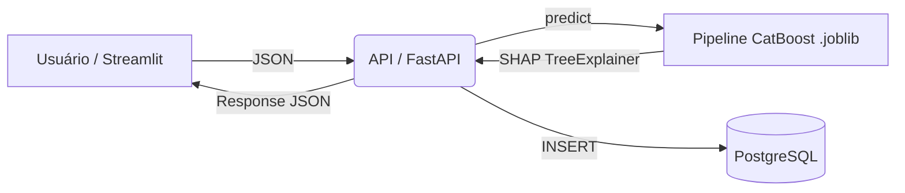

# 🏠 House Pricing: Sistema de Precificação Imobiliária


> Um sistema de Machine Learning ponta a ponta para o mercado imobiliário, capaz de **estimar o preço de venda de um imóvel** e **explicar o motivo** de cada estimativa, através de uma API com modelo CatBoost e explicabilidade via SHAP.

---

## 🎯 O Problema

Em plataformas do tipo *iBuyer* (que compram e vendem imóveis diretamente), precificar uma propriedade rapidamente e de forma justa é crítico para o negócio.

* Avaliações manuais são precisas, mas lentas e caras em escala.
* Modelos de ML sozinhos são rápidos, mas funcionam como "caixa-preta" — difícil justificar o preço para um cliente ou auditor.

**A solução:** um pipeline de regressão (CatBoost) que não só prevê o preço, como também decompõe a predição nas características que mais pesaram na decisão, além de sinalizar automaticamente imóveis atípicos para revisão manual.

---

## 🚀 Funcionalidades

* **💰 Predição de Preço:** modelo CatBoost treinado sobre dados históricos de vendas, com engenharia de atributos (idade do imóvel, encoding de CEP pela mediana de preços, flags de reforma/porão).
* **🧠 Explicabilidade (SHAP):** cada resposta da API traz o ranking das *features* que mais aumentaram ou diminuíram o preço estimado.
* **🚩 Fila de Revisão Automática:** imóveis previstos acima de US$ 1.000.000, ou com mais de 6 quartos / 4 banheiros, são sinalizados como `review` em vez de `approved`.
* **🗃️ Auditoria Completa:** toda predição (entrada + saída) é persistida em PostgreSQL para rastreabilidade.
* **📊 Dashboard Interativo:** frontend em Streamlit com formulário guiado por abas e gráfico de impacto das *features* (SHAP) em tempo real.
* **🐳 Containerização Total:** API, frontend e banco isolados e orquestrados via Docker Compose.

---

## 🏗️ Arquitetura do Projeto



---

## 📂 Estrutura de Pastas

```plaintext
📦 house-pricing
.
├── 📂 notebooks
│   └── 📓 house_pricing_modeling.ipynb   # CRISP-DM: EDA, preprocessamento, modelagem
├── 📂 models
│   └── 🧠 pipeline_catboost_house_pricing.joblib   # Pipeline campeão, exportado do notebook
├── 📂 data
│   └── 📄 house_prices.csv               # Dataset bruto (Kaggle)
├── 📂 api                                # O Cérebro (Backend FastAPI)
│   ├── 📄 main.py                        # Endpoint /predict + explicabilidade SHAP
│   ├── 📄 database.py                    # Modelos e sessão SQLAlchemy
│   ├── 📄 requirements.txt
│   └── 🐳 Dockerfile
├── 📂 frontend                           # A Cara (Streamlit)
│   ├── 📄 app.py
│   ├── 📄 requirements.txt
│   └── 🐳 Dockerfile
├── 📂 scripts
│   └── 📄 populate_db.py                 # Simulação de tráfego / smoke test
├── 🐳 docker-compose.yml
├── ⚙️ .env.example
├── 📄 LICENSE
└── 📄 .gitattributes                     # Configuração do Git LFS
```

---

## 🧬 Metodologia (CRISP-DM)

Todo o processo de modelagem — entendimento do negócio, entendimento e preparação dos dados, modelagem (da regressão linear a ensembles de voting/blending/stacking) e avaliação — está documentado em
[`notebooks/house_pricing_modeling.ipynb`](notebooks/house_pricing_modeling.ipynb).

O notebook compara mais de uma dezena de algoritmos de regressão (Linear, Ridge, Lasso, Elastic Net, KNN, Árvore de Decisão, SVR, MLP, Random Forest, Gradient Boosting, XGBoost, LightGBM, CatBoost, HistGradientBoosting e ensembles de Voting/Stacking), validados e avaliados com MAE, RMSE e R². O modelo com melhor desempenho no conjunto de validação é reavaliado uma única vez no conjunto de teste (etapa de *Evaluation* do CRISP-DM), e o pipeline vencedor — **CatBoost** com um `DataPreprocessor` customizado — é o que fica salvo em `models/pipeline_catboost_house_pricing.joblib` e é servido pela API (a mesma lógica de pré-processamento é replicada em `api/main.py`).

> As métricas de desempenho detalhadas de cada modelo estão disponíveis executando o notebook — os outputs não ficam versionados no repositório.

---

## 🛠️ Instalação e Execução

**Pré-requisitos**
- Docker e Docker Compose
- [Git LFS](https://git-lfs.com/) (o repositório versiona o dataset, o modelo treinado e artefatos via LFS — rode `git lfs install` uma vez, depois clone normalmente)

**Passo 1: Configurar variáveis de ambiente**
```bash
cp .env.example .env
# edite o .env com suas próprias credenciais
```
`.env` é git-ignorado e nunca deve ser commitado.

**Passo 2: Subir a stack completa**
```bash
docker compose up --build
```

- **Frontend (Streamlit):** http://localhost:8501
- **Documentação da API (Swagger):** http://localhost:8000/docs
- **PostgreSQL:** localhost:5432 (credenciais do `.env`)

**Passo 3 (opcional): Simular tráfego**

Com a stack no ar, popule o banco com predições de exemplo extraídas do dataset original:
```bash
cd scripts
pip install -r requirements.txt
python populate_db.py
```

---

## 🧪 Como Testar a API

Envie requisições `POST` para `http://localhost:8000/predict`.

**Exemplo de payload:**
```json
{
  "date": "20260701T000000",
  "bedrooms": 3,
  "bathrooms": 2.0,
  "sqft_living": 1800,
  "sqft_lot": 5000,
  "floors": 1.0,
  "waterfront": 0,
  "view": 0,
  "condition": 3,
  "grade": 7,
  "yr_built": 1990,
  "yr_renovated": 0,
  "zipcode": "98125",
  "lat": 47.7210,
  "long": -122.3190,
  "sqft_basement": 0
}
```

**Resposta:**
```json
{
  "status": "success",
  "record_id": 1,
  "processing_status": "approved",
  "estimated_price": 452380.55,
  "explainability": [
    {"feature": "grade", "effect": "Increased the value", "impact_weight": 0.182}
  ]
}
```

---

## 📊 Performance e Resultados

| Etapa | Abordagem |
| :--- | :--- |
| Seleção de modelo | Comparação de 14+ algoritmos de regressão + ensembles (Voting/Stacking) por validação cruzada |
| Métricas usadas | MAE, RMSE e R² (calculadas na escala real de preço, revertendo a transformação log) |
| Modelo campeão | **CatBoost** com pipeline de pré-processamento customizado (encoding de CEP, idade do imóvel, flags de reforma/porão) |
| Explicabilidade | SHAP `TreeExplainer`, top-5 *features* retornadas por predição |
| Regra de negócio | Preço > US$ 1M, quartos > 6 ou banheiros > 4 → fila de revisão manual |

> Para os números exatos de MAE/RMSE/R² de cada modelo, execute o notebook — o pipeline final está disponível em `models/pipeline_catboost_house_pricing.joblib`.

---

## 📸 Screenshots

<!--
  Adicione screenshots reais aqui, por exemplo:
  
  
-->

| Formulário de predição | Resultado & explicabilidade SHAP |
|---|---|
| _screenshot em breve_ | _screenshot em breve_ |

> Rode `docker compose up --build` e acesse http://localhost:8501 para ver ao vivo.

---
